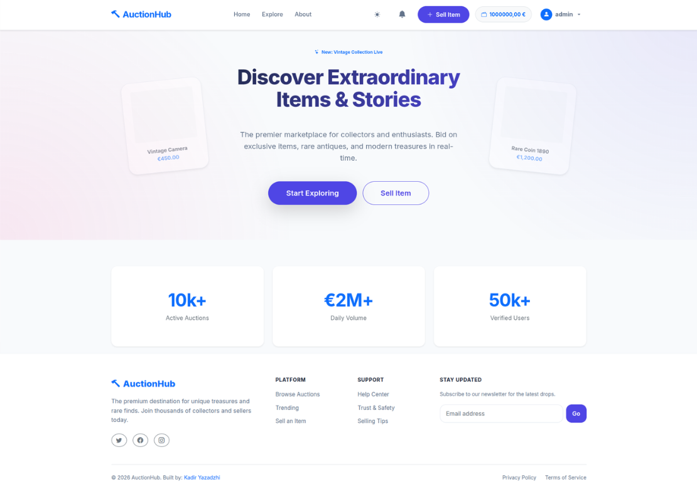
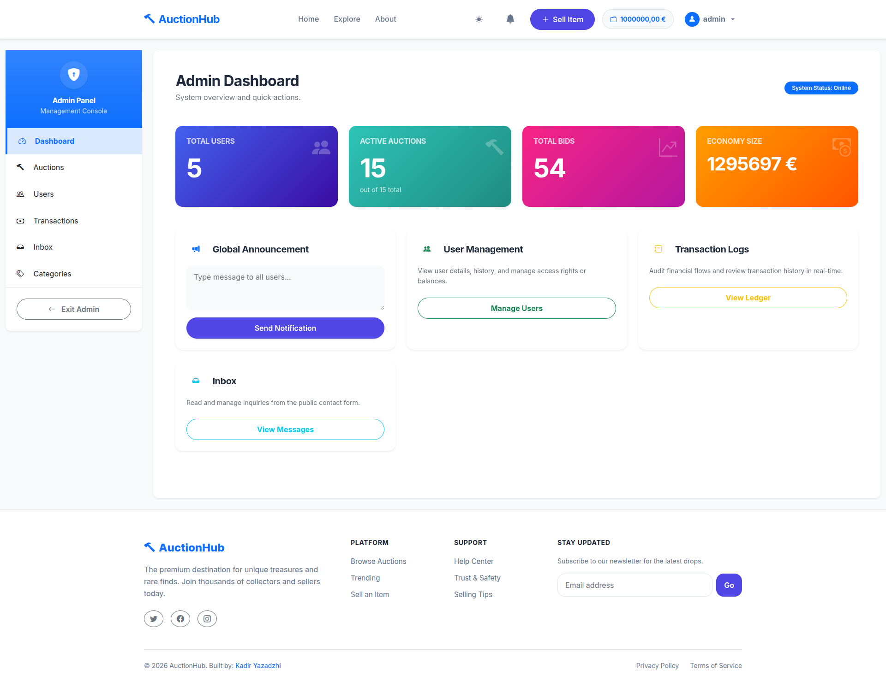
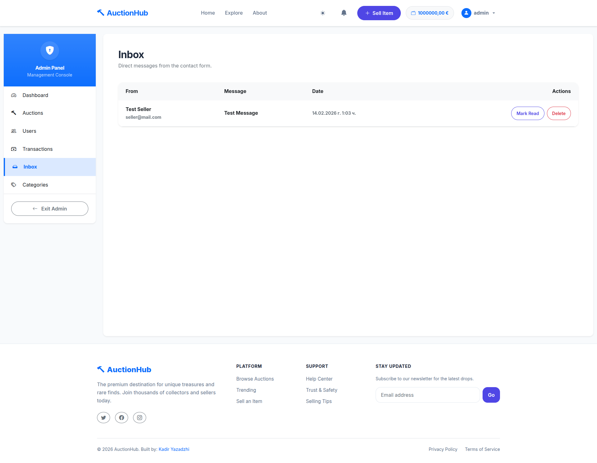
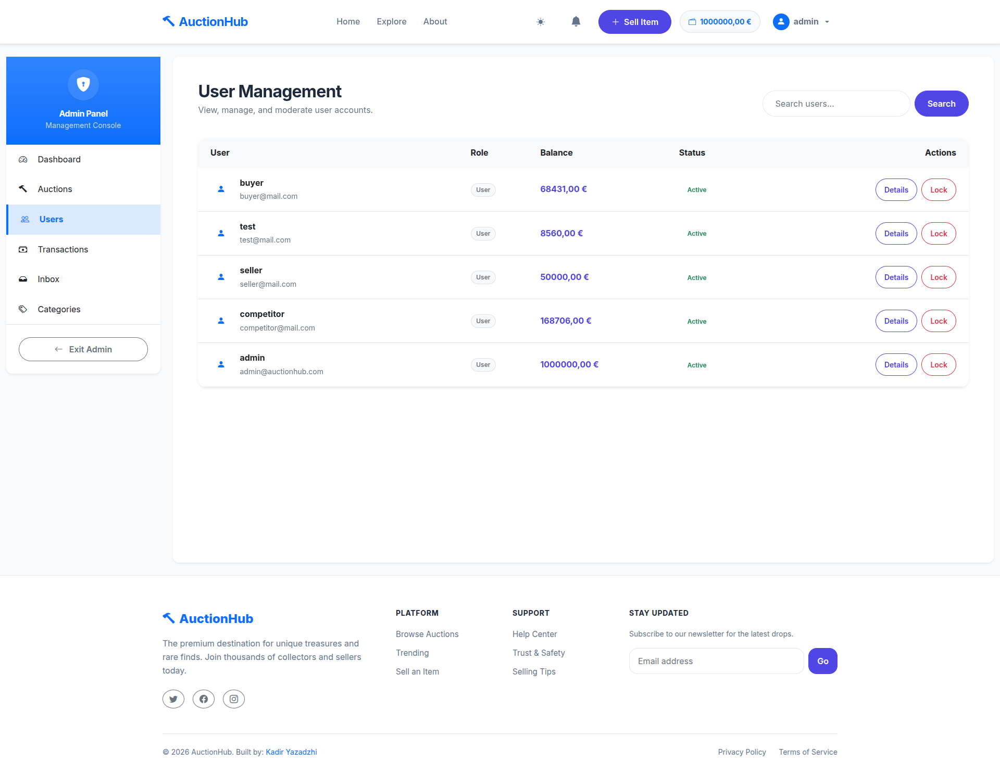
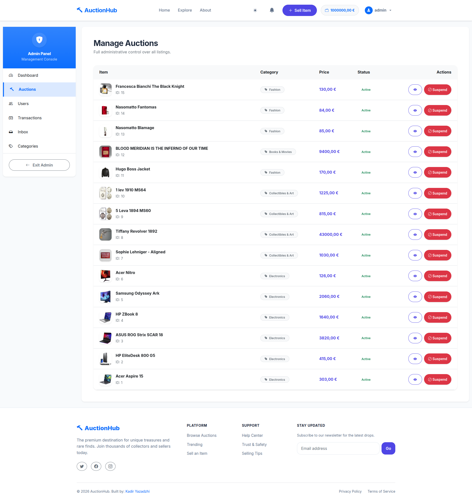
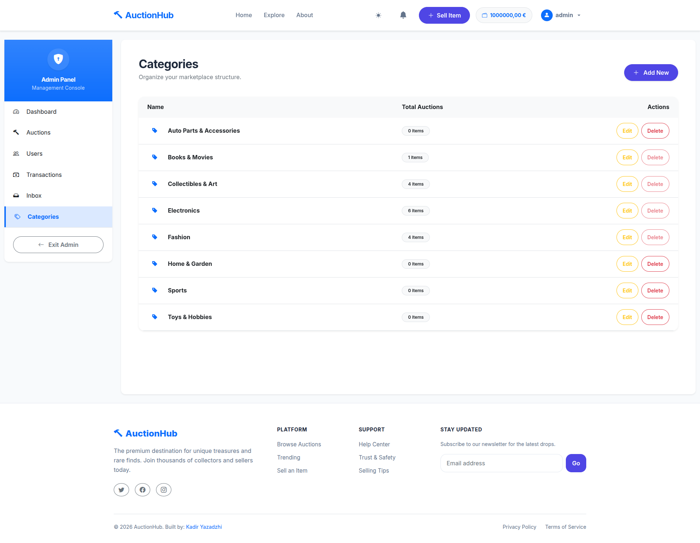
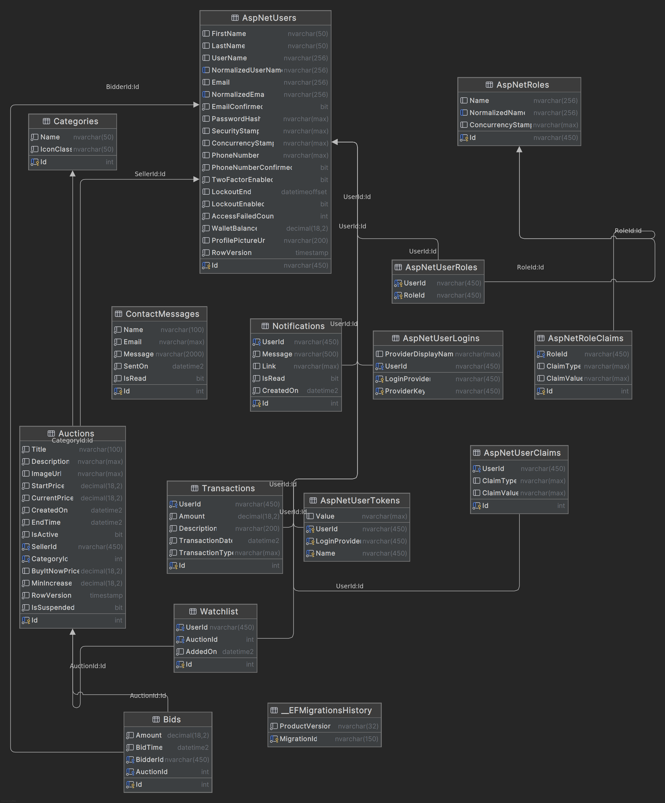
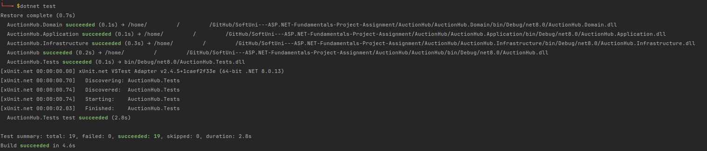

# 🔨 AuctionHub - Premium Digital Marketplace

[](https://dotnet.microsoft.com/)
[](https://docs.microsoft.com/en-us/ef/core/)
[](https://getbootstrap.com/)
[](LICENSE)
[](https://auctionhub-kadir.azurewebsites.net/)

**AuctionHub** is a robust, full-stack ASP.NET Core application designed to simulate a real-world auction environment. It features a complete financial ledger system, real-time bidding logic with concurrency protection, and a comprehensive administration dashboard.

<br />

<br />

---

## 📑 Table of Contents
1. [🌟 Key Features](#-key-features)
2. [📸 Gallery & UI](#-gallery--ui)
3. [⚙️ How It Works](#-how-it-works)
4. [🏗️ Technical Architecture](#-technical-architecture)
5. [💾 Database Schema](#-database-schema)
6. [📂 Project Structure](#-project-structure)
7. [🚀 Installation](#-installation--setup)
8. [🧪 Testing](#-testing)

---

## 🌟 Key Features

### 🛒 Auction System
* **Dynamic Listings:** Users can create auctions with start time, end time, and starting price.
* **Smart Bidding:**
    * **Validation:** Prevents bids lower than the current price.
    * **Self-Outbid Protection:** Users cannot bid on their own auctions.
    * **Concurrency Control:** Uses `RowVersion` to handle simultaneous bids seamlessly.
* **Buy It Now:** Option for immediate purchase functionality.
* **Watchlist:** Users can "star" items to track them without bidding.

### 💰 Financial Ecosystem (Wallet)
* **Internal Banking:** Every user has a digital wallet.
* **Escrow Service:** When a bid is placed, funds are **locked** (hold) immediately.
* **Auto-Refund:** If a user is outbid, their held funds are automatically released back to their available balance.
* **Transaction Ledger:** A persistent history of all Deposits, Withdrawals, Holds, and Releases.

### 🛡️ Administration Area
* **Dashboard:** Real-time metrics (Total Users, Active Auctions, Volume).
* **User Management:** Ability to view user details and history.
* **Communication Hub:** Internal Inbox to read and manage user inquiries (Contact Messages).
* **Moderation:** Admins can edit categories and suspend suspicious auctions.

### 🔔 User Engagement
* **Notifications:** Alert system for "Auction Won", "Outbid", or "Auction Ended".
* **Direct Support:** Integrated "Contact Us" form for user inquiries.
* **Search & Filter:** Advanced filtering by Category, Price Range, and Status.

---

## 📸 Gallery & UI

### 1. User Experience (The Marketplace)

**Explore All Auctions**
*A clean grid view of all available items.*


**Advanced Filtering**
*Users can filter by specific categories and price ranges.*


**Auction Details & Bidding**
*Detailed view showing current bid, bid history, and countdown timer.*


**My Wallet**
*The financial hub showing balance and transaction history.*


---

### 2. Administration Area

**Admin Dashboard**
*Real-time statistics and platform overview.*


**Admin Inbox**
*Internal communication and system notifications.*


**User Management**
*View, edit, or ban users.*


**Auction Management**
*Oversee all active and expired auctions.*


**Category Management**
*Create and edit product categories.*


**Transaction Logs**
*Audit trail of all financial movements in the system.*


---

## ⚙️ How It Works

1.  **Registration:** User creates an account via ASP.NET Identity.
2.  **Deposit:** User adds virtual funds to their Wallet via the "Deposit" action.
3.  **Bid:**
    * User places a bid on an item.
    * System checks `AvailableBalance`.
    * Funds are moved to `HeldBalance` (Escrow).
    * Previous highest bidder gets their funds refunded instantly.
4.  **Win:**
    * Auction timer expires (handled by `AuctionCleanupService`).
    * Winner's held funds are transferred to the Seller.
    * Ownership of the item is transferred.

---

## 🏗️ Technical Architecture

The solution implements a **Layered Architecture** (Clean Architecture principles) to ensure scalability, maintainability, and testability.

* **Presentation Layer (`AuctionHub`):** ASP.NET Core MVC (Controllers & Views). Handles user interaction and UI rendering.
* **Application Layer (`AuctionHub.Application`):** Contains all business logic and service interfaces. This layer is independent of the database and UI.
* **Domain Layer (`AuctionHub.Domain`):** Defines the core entities and database models.
* **Infrastructure Layer (`AuctionHub.Infrastructure`):** Handles data access (EF Core), database migrations, and external concerns.
* **Background Services:**
    * `AuctionCleanupService`: A hosted service (`IHostedService`) that runs in the background to automatically close expired auctions and process transfers.

### Tech Stack
| Component | Technology |
|-----------|------------|
| **Framework** | .NET 8.0 (C# 12) |
| **Web App** | ASP.NET Core MVC |
| **Database** | MS SQL Server 2019+ |
| **ORM** | Entity Framework Core (Code-First) |
| **Frontend** | Razor, Bootstrap 5, jQuery |
| **Testing** | xUnit, Moq, EF Core InMemory |

---

## 💾 Database Schema

The database relies on strong relationships to ensure data integrity.



---

## 📂 Project Structure

```text
AuctionHub/
├── AuctionHub/                   # Web Presentation Layer (ASP.NET Core MVC)
│   ├── Areas/
│   │   ├── Admin/                # Administration Area
│   │   └── Identity/             # Authentication Pages
│   ├── Controllers/              # MVC Controllers
│   ├── Views/                    # Razor Views
│   ├── wwwroot/                  # Static Files (CSS, JS)
│   ├── appsettings.json          # Configuration
│   └── Program.cs                # Entry Point & DI Configuration
├── AuctionHub.Application/       # Application Layer (Business Logic)
│   ├── DTOs/                     # Data Transfer Objects
│   ├── Interfaces/               # Service Contracts
│   └── Services/                 # Service Implementations (Auction, Wallet, etc.)
├── AuctionHub.Domain/            # Domain Layer (Core Entities)
│   └── Models/                   # Database Models
├── AuctionHub.Infrastructure/    # Infrastructure Layer (Data Access)
│   ├── Data/                     # DbContext & Seeding
│   └── Migrations/               # EF Core Migrations
└── AuctionHub.Tests/             # Unit Tests
```

---

## 🚀 Installation & Setup

You can set up the project using either **Docker** (Recommended) or a **Standard Local SQL Server**.

### Option 1: Docker Setup (Recommended)
*This method automatically provisions the database with the correct configuration.*

1. **Prerequisites:**
   * Docker Desktop / Docker Engine
   * .NET 8.0 SDK

2. **Clone the Repo:**
   ```bash
   git clone https://github.com/KadirYazadzhi/AuctionHub
   cd AuctionHub
   ```

3. **Start the Database:**
   Run this in the root directory (where `docker-compose.yml` is located):
   ```bash
   docker-compose up -d
   ```
   *Starts MSSQL Server on port `5899`.*

4. **Apply Migrations:**
   ```bash
   dotnet ef database update --project AuctionHub.Infrastructure --startup-project AuctionHub
   ```

5. **Run the Application:**
   ```bash
   cd AuctionHub
   dotnet run
   ```

---

### Option 2: Standard Setup (Local SQL Server)
*Use this if you already have a local SQL Server instance running.*

1. **Prerequisites:**
   * SQL Server (LocalDB or full instance)
   * .NET 8.0 SDK

2. **Clone the Repo:**
   ```bash
   git clone https://github.com/KadirYazadzhi/AuctionHub
   cd AuctionHub/AuctionHub
   ```

3. **Configure Connection:**
   * Open `appsettings.json`.
   * **Important:** The default connection string is for Docker (Port 5899). Change `"DefaultConnection"` to point to your local instance.
     * Example: `Server=.;Database=AuctionHubDb;Trusted_Connection=True;TrustServerCertificate=True;MultipleActiveResultSets=true`

4. **Database Migration:**
   ```bash
   dotnet ef database update --project ../AuctionHub.Infrastructure --startup-project .
   ```

5. **Run:**
   ```bash
   dotnet run
   ```

---

### 🔑 Login Credentials (Seed Data)

* **Admin:** `admin@auctionhub.com` or `admin` / `Admin123!` (Check `DbSeeder.cs` to confirm)
* **User:** You can register a new user normally.

---

## 🧪 Testing

The project utilizes **xUnit** for unit testing, focusing on the Service Layer to ensure business logic validity.

* **Mocking:** `Moq` is used to simulate Database Context and repositories.
* **Coverage:** Covers Bidding logic, Validation, and Wallet calculations.

Run tests with:

```bash
dotnet test

```

### ✅ Unit Test Results

| Status | Test Name | Duration |
| --- | --- | --- |
| 🟢 **Pass** | `PlaceBidAsync_ShouldPlaceBidSuccessfully` | 4ms |
| 🟢 **Pass** | `BuyItNowAsync_ShouldSucceedAndCloseAuction` | 7ms |
| 🟢 **Pass** | `PlaceBidAsync_ShouldRefundPreviousBidder` | 1.1s |
| 🟢 **Pass** | `PlaceBidAsync_ShouldFail_WhenInsufficientFunds` | 3ms |
| 🟢 **Pass** | `PlaceBidAsync_ShouldFail_WhenBidIsTooLow` | 3ms |
| 🟢 **Pass** | `PlaceBidAsync_ShouldFail_WhenUserIsAdministrator` | 3ms |
| 🟢 **Pass** | `PlaceBidAsync_ShouldFail_WhenSellerBidsOnOwnAuction` | 2ms |
| 🟢 **Pass** | `PlaceBidAsync_ShouldFail_WhenAuctionIsInactive` | 2ms |
| 🟢 **Pass** | `PlaceBidAsync_ShouldHandleSelfOutbidCorrectly` | 32ms |
| 🟢 **Pass** | `PlaceBidAsync_ShouldEndAuction_WhenBidMeetsBuyItNowPrice` | 6ms |
| 🟢 **Pass** | `CreateAuctionAsync_ShouldCreateAuctionSuccessfully` | 3ms |
| 🟢 **Pass** | `CreateAuctionAsync_ShouldPreventDuplicates` | 25ms |
| 🟢 **Pass** | `GetAuctionsAsync_ShouldHideAdminAuctions` | 69ms |
| 🟢 **Pass** | `ToggleWatchlistAsync_ShouldAddItemToWatchlist` | 10ms |
| 🟢 **Pass** | `ToggleWatchlistAsync_ShouldRemoveItemFromWatchlist` | 38ms |
| 🟢 **Pass** | `UpdateAuctionAsync_ShouldFail_WhenBidsExist` | 18ms |
| 🟢 **Pass** | `DeleteAuctionAsync_ShouldFail_WhenBidsExist` | 4ms |
| 🟢 **Pass** | `BuyItNowAsync_ShouldFail_WhenNoBuyItNowPrice` | 26ms |
| 🟢 **Pass** | `PlaceBidAsync_ShouldFail_WhenAuctionNotFound` | 2ms |

### 📸 Execution Screenshot




## 🗺️ Roadmap & Future Plans

The project is under active development. The following features are planned for the v2.0 release (ASP.NET Advanced Module):

* **Real-Time Communication (SignalR):**
    * Global chat for community discussions.
    * Private secured chat between Seller and Winner after auction completion.
    * Live bidding updates (price updates without page refresh).
* **Reputation System:**
    * User rating & reviews (allowed only after a verified transaction).
    * "Top Seller" badges based on feedback score.
* **Monetization:**
    * "Promoted Auctions" feature: Users can pay a fee via their digital wallet to boost visibility.
* **Smart Bidding:**
    * Auto-bidder implementation (set a max price, system bids on your behalf).
* **Cloud Integration:**
    * Migrate image storage to Cloudinary/Azure Blob Storage.
* **Testing:**
    * Comprehensive Unit & Integration tests ensuring >90% code coverage.
  

---

*Project created for SoftUni ASP.NET Fundamentals Course.*
